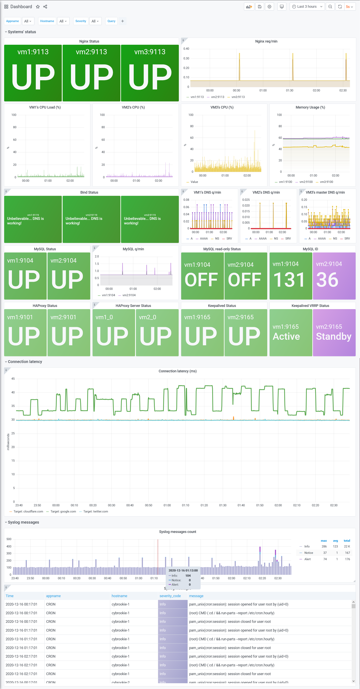

# ICA0002: IT infrastructure course, Labs

All Ansible files and outcomes for labs can be found in this repository.

The goals of the course:

- Learn how to set up modern IT infrastructure as a code with Ansible
- Study and practice setup of different infrastructure components, e.g. DNS, web server, load-balancers, web-application, virtualized containers, monitoring, etc.

## Repository structure description

Repository contains Ansible roles, Ansible tasks for separate aspect of infrastructure, Ansible configuration and infrastructure specif variables.

Each Ansible YAML playbook focused on a separate aspect of the infrastructure. Final exam `infra.yaml` sets up all fresh systems to the desired state.

It is recommended to run `delete_backup_users.yaml` playbook before `infra.yaml` to avoid some possible hiccups with backup facility setup.

To run the playbook on any other collection systems, some variables should be updated. Non-exhaustive list of variables:

- IP addresses of the target hosts and backup server
- Passwords
- Domain name for your setup, if desired
- DNS forwarders, if desired
- Ports, if desired

## Sneak peak at the resulting Grafana after completing all the labs:

